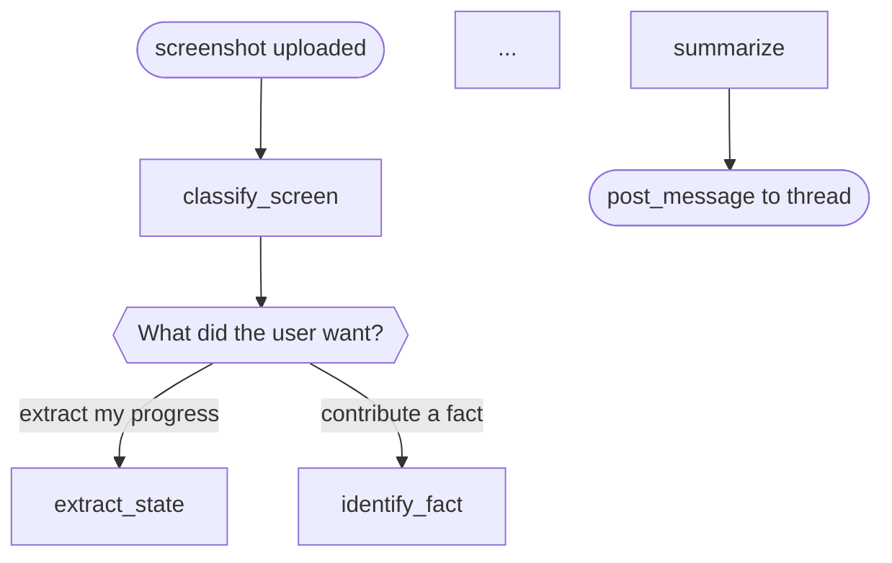

# Authoring a Loom Policy

This is the operator's guide. For the conceptual overview, see
[README.md](README.md).

You author a policy by editing **two files** that live together alongside
your agent handler:

```
my_agent.policy.mmd    # the flowchart (Mermaid)
my_agent.policy.yaml   # per-node + per-edge prompt snippets + globals
```

They share node ids — the YAML drives the *authoritative vocabulary*
for the `report_position` tool, while the Mermaid drives what the
admin UI renders and what Claude reads in its system prompt.

---

## The `.policy.mmd` file

Pure Mermaid `flowchart TD`. A few conventions Loom relies on:

- **Nodes use `snake_case` ids** that match YAML keys exactly. Do
  NOT use spaces, dots, or hyphens in ids — `report_position` must be
  able to accept them as string values.
- **Decision diamonds use `{{"..."}}`** so the admin renders them
  distinctly from function nodes. Use a verb-led question
  (`"What did the user want?"`).
- **Edge labels use `-->|"..."|`** with human-readable text. These
  labels are the branch identifiers reviewers scan for; make them
  semantically meaningful, not mechanical.
- **Entry points** use `start([...])` / `start_followup([...])` shape
  to signal they are the agent's possible entries, not functional
  phases. Multiple entries are allowed (e.g. "new screenshot" vs
  "mid-thread reply").
- **Exit points** use `done([...])` similarly. All real paths should
  converge there.

Example:



### When to split a node

Split when its prompt would need to handle two semantically distinct
phases. "Collect a fact and then write it" should be two nodes
(`identify_fact`, `write_fact`) not one. If you catch yourself
writing "if X then Y else Z" in a node's prompt, that's a diamond
waiting to be extracted.

---

## The `.policy.yaml` file

Four top-level keys:

```yaml
version: my_agent@v3        # semantic label; bump on meaningful change

globals:                     # rules that apply at EVERY node
  - |
    Write progressively, every turn. ...

nodes:                       # one entry per node id used in the .mmd
  classify_screen:
    tool: classify_screen    # optional — set if landing here fires a real tool
    prompt: |
      Identify the screen type from the image. ...

edges:                       # optional per-edge snippets keyed "source -> target"
  confirm_job -> extract_state:
    when: |
      User chose "my progress" / "progress" / "just for me".
    prompt: |
      Proceed to extraction only. Do NOT also write shape/mechanic.
```

### Choosing scope — globals vs node vs edge

This is the single most common authoring mistake. Rules are ONLY read
at their scope. Putting a cross-cutting rule in one node's prompt
means Claude never reads it when it's at any other node.

| Rule scope | Example | Where |
|---|---|---|
| Always true | "Write progressively, do not batch-collect across turns" | `globals` |
| True when at this node | "Rename the field to snake_case" at `submit_update` | `nodes.<id>.prompt` |
| True when taking this edge | "Route here only when get_items returned 0 matches" | `edges.<src-dst>.when` |

If you find yourself repeating the same sentence in three nodes,
promote it to `globals`.

If a rule is ambiguous about where it applies, the wrong scope will
silently lose — Claude won't surface the rule at turns it didn't
happen to read. **The `report_position` rationale field is your debug
tool** — read the agent's stated rationale to diagnose why a rule
wasn't applied, before assuming it's a phrasing problem.

### Writing good prompts

**Do:**
- Use direct imperatives ("Write a structural fact", "Ask ONE
  clarifying question and return").
- Name the next node explicitly when routing ("Route to
  `identify_fact` once the user confirms").
- Include short anti-examples when a rule is counter to LLM instinct
  ("Do NOT wait to collect a full schema before writing").

**Don't:**
- Restate the Mermaid in prose ("If the user chose X then go to Y") —
  it's already visible above the snippet in the assembled prompt.
- Include personality / voice instructions in node prompts. Those
  belong in the prose system-prompt intro above the policy block.
- Use hedge words ("try to", "maybe", "if possible") — Claude reads
  them as permission to skip.

### Writing good `when:` clauses

The `when:` is a *predicate the agent evaluates at a diamond*. It
should describe the observable signal that picks this edge over its
siblings.

Good:
```yaml
decide_op -> update_item:
  when: |
    get_items returned exactly 1 match AND the user is adding
    new information on the same topic (not correcting it).
```

Bad (vague):
```yaml
decide_op -> update_item:
  when: |
    There's a relevant existing item and the user knows more.
```

Bad (mechanical restatement of the edge):
```yaml
decide_op -> update_item:
  when: |
    Should update_item be called.
```

---

## The `report_position` contract

Every agent using Loom has a `report_position(node_id, rationale)`
tool. Both args are required; the tool validates `node_id` against
the YAML's allowed vocabulary and rejects empty rationales with an
error the model sees on the next turn.

**What Claude must do:**
1. On every turn that calls any tool, call `report_position` as a
   PARALLEL tool_call in the same turn.
2. Pass `node_id` from the authored set. Use `"off_policy"` only when
   reasoning genuinely leaves the flow.
3. Pass a 1-2 sentence `rationale` explaining why this node. This
   renders as a thought bubble on the admin replay and is how
   reviewers audit decisions.

**What Loom does with it:**
- Stamps `loom.current_node` on the trace span (pill color in admin).
- Keeps the rationale as an author-readable thought bubble.
- Grades adherence at replay time: green when reported, yellow when
  inferred from the next tool call, red when mismatched.

---

## Policy version, sha, and the barrier

`Policy.version` comes from the YAML's `version:` field — a semantic
label like `my_agent@v3`. Bump it whenever you make a meaningful
change.

`Policy.sha` is a short content hash of the `.policy.mmd`. It changes
whenever the *structure* of the flowchart changes, but NOT when only
the YAML is edited. This is intentional:

- **Pure YAML edit** (clarify a snippet, reword an invariant) — sha
  stays the same. No barrier is injected on resumed threads. The new
  prompt takes effect on the next turn; Claude reads it but no
  explicit reminder is issued.
- **Structural edit** (add/remove a node, retarget an edge) — sha
  changes. On any resumed thread whose last turn ran under a
  different sha, Loom injects a policy-update `HumanMessage` at the
  head of the new turn and emits a visible barrier frame in the
  replay.

When in doubt, favor a structural edit so the barrier fires and
reviewers see where behavior is expected to shift.

---

## Iteration loop — the short version

1. Edit the `.mmd` and/or `.yaml`.
2. Deploy your agent (redeploy the Lambda, restart the server, etc.).
3. Trigger the scenario that exposed the bug.
4. Open the admin Loom replay for that run:
   - **Pill** (top-right) — green = reported; yellow = inferred;
     red = off-policy.
   - **Rationale bubble** (top-left) — Claude's stated "why" for the
     active node. Read it FIRST when diagnosing.
   - **Node highlight** on the Mermaid — current position colored to
     match the pill.
   - **Click any node** — see the authored snippet + outgoing edges.
5. If behavior shifted toward the authored rule -> ship it.
6. If not -> **do not simply rephrase.** Check:
   - Does the rule live at the right scope (global vs node vs edge)?
   - Does the rationale bubble show the agent understood the rule?
   - Does the flowchart actually offer the path the rule requires?

---

## Enforcement layers — when prompt rules lose

Loom assumes authored policy will be ignored sometimes — Claude's
training biases can out-compete any individual prompt rule under
pressure. The response isn't to shout louder in the prompt; it's to
add more layers so no single layer is load-bearing alone.

**The four layers, weakest to strongest:**

| # | Layer | Mechanism | When it works |
|---|---|---|---|
| 1 | Prompt-level policy | Mermaid + invariants + snippets rendered via `render_prompt_section` | Default case. Claude reads, Claude obeys. |
| 2 | Position reporting | `report_position(node_id, rationale)` required on tool-using turns | Always. Makes deviation visible at replay time. |
| 3 | Rationale audit | `rationale` required arg, rendered as a bubble on the chart | Always. The agent's stated "why" exposes anti-patterns like "let me collect all facts before writing" in plain text. |
| 4 | Tool-layer rejection | `loom_agentic.enforcement` primitives return error strings to the model | When layers 1-3 diagnose a bug that prompt edits can't fix. |

**Layers 1-3 make a bug diagnosable. Layer 4 makes a bug impossible.**

When to reach for each:

- A rule Claude normally follows, you've never seen violated ->
  Layer 1 is sufficient.
- A rule you want to *verify* was followed on every run -> add Layer
  2/3 (on by default for `report_position`).
- A rule Claude keeps violating despite clear prompt text -> add
  Layer 4. The rationale bubble should tell you *why* it keeps
  violating; that diagnosis informs which primitive to reach for
  (or to write).

### Layer-4 primitives (`loom_agentic.enforcement`)

Each primitive is a small function that returns either an error
string (for the tool to return verbatim to the model) or None when
the call is acceptable. Domain-agnostic mechanism; the consuming app
decides which tools get which guards.

Current:
- **`reject_packed_dict(tool_name, value)`** — reject dict values
  with more than one key. Born from observing an agent pack seven
  confirmed facts into a single tool call because it LOOKED like
  "one tool call, one write" to the model. Disable on tools where
  multi-key dicts are legitimately atomic.

Planned (ongoing):
- `reject_unknown_node_id(allowed, node_id)` — factor out of
  `report_position` so any vocabulary-gated tool can reuse it.
- `reject_missing_rationale(value)` — likewise.
- `reject_stale_version(expected_sha, got_sha)` — enforce policy
  sha stamps on tool calls that must pin to a version.

Application in a tool wrapper:

```python
from loom_agentic.enforcement import reject_packed_dict

@tool
def apply_correction(path: str, value: Any, note: str = '') -> str:
    """Update ONE confirmed fact. Scalar only."""
    err = reject_packed_dict('apply_correction', value)
    if err: return err
    return _call('apply_correction', {'path': path, 'value': value, 'note': note})
```

When a primitive rejects a call, the event log shows the failed
tool call + the error return. Loom's replay stepper surfaces that
as a frame, so reviewers can scrub to see the agent being course-
corrected in real time — not just "the run went green eventually."

---

## Common failure modes

| Symptom | Likely cause |
|---|---|
| Rule added to a node, agent ignored it | Agent never reached that node. Check adherence against the position pill; promote to `globals` if cross-cutting. |
| Rule added to `globals`, still ignored | Not a scope problem — phrasing is competing with Claude's training defaults. Add an anti-example and a consequence ("this is off-policy"). |
| Pill stays yellow (inferred) | `report_position` not being called. Usually: the turn is a reply-only turn with no other tool call, so the prompt says skipping is fine. Check the tool-call count in the frame. |
| Pill turns red (off_policy) | Claude invented a `node_id` not in the YAML vocabulary. Either add the missing node or tighten existing snippets so Claude sees where to route. |
| Agent inside a resumed thread keeps doing what it did before policy change | Policy change was YAML-only; sha didn't change; no barrier fired. Make a structural change or manually bump by editing the mermaid. |
| `FileNotFoundError: policy '...'` at cold start | Deploy didn't include the `.mmd` or `.yaml` in the package. |
