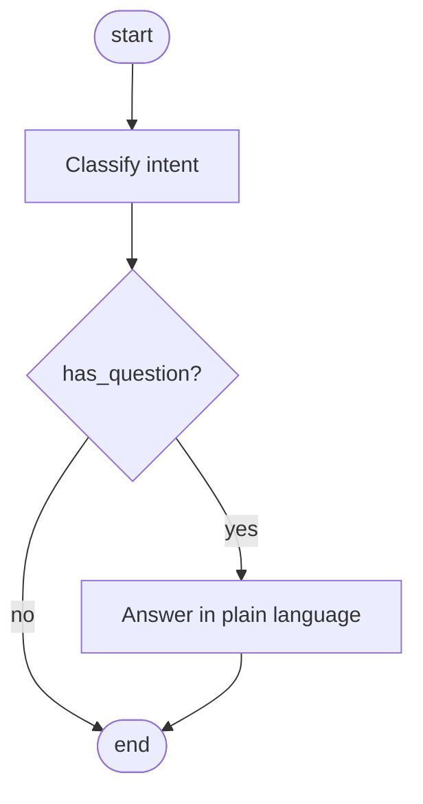
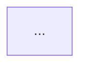

# Plan 0 — Build loom's policy loader, report_position tool, and event log writer

## Status note (added during step 1 — reading existing code)

After reading `replay/loader.py`, `replay/stepper.py`, `replay/__init__.py`, `replay/mermaid_for_run.py`, and `orchestrate/mermaid_parser.py`, the replay infrastructure is more loom-aware than the README suggested:

- `on_graph_structure` event already supports a `mermaid` field — `mermaid_for_run` returns it verbatim
- `on_context_carry` event already captures system_prompt + prompt_sections + first_user_message + policy stamp; `serialize_run` includes it in output
- `on_policy_update` event already rendered as a synthetic barrier marker in stepper
- `run_policy` (version + sha) already plumbed end-to-end via `on_graph_structure`

What's actually missing:
1. Loader (writing side) — no public API to author and emit these events; callers have to hand-roll the JSONL records
2. Policy primitives — `load_policy`, `Policy`, `render_prompt_section`, `report_position_tool`, barrier message synthesis
3. **Stepper extension** — current `STORY_EVENTS` is `{on_chat_model_end, on_tool_start, on_tool_end}` (pure LangGraph). Doesn't handle `on_position_report`. New event type + frame logic needed.
4. **Terminology** — "context carry" already exists in loom meaning "verbatim system prompt the agent READ." Plan 1's "reasoning carry" (agent-emitted structured working state) is a DIFFERENT concept and will need a different name (`working_memory`, `reasoning_state`) to avoid silent collision.

## Problem statement

The loom_agentic README and DOCS describe a complete authoring + runtime + replay loop:
- `.policy.mmd` + `.policy.yaml` files authored alongside the agent
- `load_policy()` assembles them into a `Policy` object
- `Policy.render_prompt_section()` produces the 4-section prompt block (invariants + mermaid + per-node/edge snippets + position contract)
- `report_position(node_id, rationale)` tool the agent calls every turn
- Event log written in a JSONL format that `loom_agentic.replay.loader` already knows how to read
- `policy_version` / `policy_sha` barrier injected on resumed threads under a newer policy

The replay side is built. The orchestrate side (Mermaid → LangGraph compiler) is built. The **policy / runtime side is not** — `load_policy`, `render_prompt_section`, `report_position`, and the event log writer don't exist as code. Documentation is aspirational.

This plan builds those primitives so downstream work (kepler integration, carry, thinking capture) has real APIs to call.

## Proposed architecture

New package `loom_agentic/policy/` parallel to `orchestrate/` and `replay/`. Provider-agnostic — produces JSON Schema tool definitions and prompt strings; doesn't import any LLM SDK. Event log writer is a separate small module that emits the JSONL shape `replay/loader.py` already consumes.

```
loom_agentic/
├── policy/                         ← NEW
│   ├── __init__.py                 ← public API: load_policy, Policy, report_position_tool
│   ├── loader.py                   ← .mmd + .yaml → Policy
│   ├── model.py                    ← Policy dataclass + helpers
│   ├── render.py                   ← render_prompt_section()
│   ├── tool.py                     ← report_position JSON Schema generator
│   ├── barrier.py                  ← policy-update barrier message synthesis
│   └── tests/
│       ├── fixtures/
│       │   ├── sample.policy.mmd
│       │   └── sample.policy.yaml
│       ├── test_loader.py
│       ├── test_render.py
│       ├── test_tool.py
│       └── test_barrier.py
├── eventlog/                       ← NEW
│   ├── __init__.py                 ← public API: emit_event, EventWriter
│   ├── writer.py                   ← JSONL writer matching replay/loader format
│   └── tests/
│       └── test_writer.py
├── orchestrate/...                 ← unchanged
├── replay/...                      ← unchanged
└── enforcement.py                  ← unchanged
```

## File format specs

### `<agent>.policy.mmd`

Verbatim Mermaid flowchart. Loaded as a string. Sha computed over the raw bytes.



Constraints (validated by loader):
- Must be a valid mermaid flowchart (`flowchart TD` or `flowchart LR`)
- Node ids must be `[a-z_][a-z0-9_]*` (no spaces, dots, hyphens — they have to be valid `report_position` enum values)
- Must contain at least one `START([...])` and one `END([...])` node, or equivalent terminal nodes
- All nodes referenced in `.yaml` must exist in `.mmd`

### `<agent>.policy.yaml`

```yaml
version: "v1"
globals:
  - "Apply at every node: never invent coordinates."
  - "If user asks a question, the next assistant turn answers it."
nodes:
  classify:
    prompt: |
      Read the user's most recent message. Identify their intent in one sentence.
  answer:
    prompt: |
      Compose a direct answer. No preamble.
edges:
  "route->answer":
    when: "has_question is true"
    prompt: |
      Acknowledge the question, then answer.
```

All sections optional except `version`. Loader is forgiving — missing nodes/edges sections fine.

## Public API

```python
from loom_agentic.policy import load_policy, Policy, report_position_tool, policy_update_barrier_message
from loom_agentic.eventlog import EventWriter, emit_event

# At cold start
policy = load_policy("kepler_director", search_dirs=["./prompts"])

# In system prompt assembly
system_prompt = BASE_PROMPT + "\n\n" + policy.render_prompt_section()

# In tool definitions
tools = [report_position_tool(policy), ...other_tools]

# In each turn
writer = EventWriter(path=f"runs/{session_id}.jsonl",
                     policy_version=policy.version,
                     policy_sha=policy.sha)
writer.emit("on_message", {"role": "user", "text": "..."})
writer.emit("on_tool_call", {"name": "dino_detect", "args": {...}})
# etc.

# On resume with newer policy
if last_run_sha != policy.sha:
    barrier_msg = policy_update_barrier_message(
        agent_name="kepler_director",
        old_version="v2", old_sha="180cdc02",
        new_version=policy.version, new_sha=policy.sha,
    )
    messages.insert(0, barrier_msg)
    writer.emit("on_policy_update", {...})
```

## Policy dataclass

```python
@dataclass(frozen=True)
class Policy:
    name: str                       # "kepler_director"
    version: str                    # from yaml: "v1"
    sha: str                        # sha256(mermaid_bytes)[:8]
    mermaid: str                    # raw .mmd contents
    globals: list[str]
    node_ids: list[str]             # parsed from mermaid, in declaration order
    node_prompts: dict[str, str]    # node_id → snippet (may be missing)
    edge_prompts: dict[tuple[str, str], EdgePrompt]
    raw_yaml: dict                  # full parsed yaml, for forward-compat

    def render_prompt_section(self) -> str: ...
    def has_node(self, node_id: str) -> bool: ...
```

## render_prompt_section() output shape

Four sections, exactly as DOCS.md describes:

```
## Loom policy: kepler_director (v1, sha 7a3b9c12)

### Invariants (apply at every node)
- Apply at every node: never invent coordinates.
- If user asks a question, the next assistant turn answers it.

### Flowchart


### Per-node and per-edge guidance
**Node `classify`** — Read the user's most recent message. Identify their intent in one sentence.
**Node `answer`** — Compose a direct answer. No preamble.
**Edge `route → answer`** (when has_question is true) — Acknowledge the question, then answer.

### Position-reporting contract
Whenever you call any tool, you MUST also call `report_position(node_id, rationale)` as a parallel tool call.
- Allowed `node_id` values: `classify`, `route`, `answer`
- `rationale`: one sentence explaining why you're at this node right now.
```

## report_position tool — JSON Schema

```python
def report_position_tool(policy: Policy) -> dict:
    return {
        "name": "report_position",
        "description": "Report your current position on the policy flowchart. Required parallel call when invoking any other tool.",
        "input_schema": {
            "type": "object",
            "properties": {
                "node_id": {
                    "type": "string",
                    "enum": policy.node_ids,
                    "description": "Your current flowchart node.",
                },
                "rationale": {
                    "type": "string",
                    "description": "One sentence: why are you at this node right now?",
                    "minLength": 1,
                },
            },
            "required": ["node_id", "rationale"],
        },
    }
```

The `enum` constraint enforces closed vocabulary at the SDK level — Anthropic's API rejects calls with non-enum values before the model's output reaches your handler. That's free layer-4 enforcement on node-id hallucination.

## Event log writer

`replay/loader.py` already defines what events look like. Read it, match its expectations exactly. Strawman:

```python
class EventWriter:
    def __init__(self, path: str, policy_version: str, policy_sha: str,
                 run_id: str = None, agent_name: str = None):
        self.path = path
        self.run_id = run_id or str(uuid.uuid4())
        self.policy_version = policy_version
        self.policy_sha = policy_sha
        self.agent_name = agent_name
        self._lock = threading.Lock()
        # write header event
        self._emit("on_run_start", {})

    def emit(self, event_type: str, payload: dict):
        with self._lock:
            record = {
                "ts": time.time(),
                "run_id": self.run_id,
                "agent": self.agent_name,
                "policy_version": self.policy_version,
                "policy_sha": self.policy_sha,
                "type": event_type,
                "payload": payload,
            }
            with open(self.path, "a") as f:
                f.write(json.dumps(record) + "\n")
```

Verify the field names against `replay/loader.py` before finalizing. If they mismatch, change the writer (don't touch the loader — replay tests already pass against its assumed format).

## Files to create

- `loom_agentic/policy/__init__.py`
- `loom_agentic/policy/loader.py`
- `loom_agentic/policy/model.py`
- `loom_agentic/policy/render.py`
- `loom_agentic/policy/tool.py`
- `loom_agentic/policy/barrier.py`
- `loom_agentic/policy/tests/fixtures/sample.policy.mmd`
- `loom_agentic/policy/tests/fixtures/sample.policy.yaml`
- `loom_agentic/policy/tests/test_loader.py`
- `loom_agentic/policy/tests/test_render.py`
- `loom_agentic/policy/tests/test_tool.py`
- `loom_agentic/policy/tests/test_barrier.py`
- `loom_agentic/eventlog/__init__.py`
- `loom_agentic/eventlog/writer.py`
- `loom_agentic/eventlog/tests/test_writer.py`

## Files to modify

- `loom_agentic/__init__.py` — re-export Policy, load_policy, EventWriter (the docstring already says top-level imports nothing; keep that — re-exports just point to submodules)
- `pyproject.toml` — add `pyyaml` to base dependencies (loader needs it). Mermaid parsing reuses `orchestrate/mermaid_parser.py` — no new dep there.
- `README.md` — flip "Plugin mode [future]" line in `__init__.py` docstring; add note that policy + eventlog are now built
- `DOCS.md` — verify what's described matches what's built; tighten any divergences

## Step-by-step plan (revised after step 1 + 2 inspection)

1. ✅ Read replay code — DONE. Findings in status note above.
2. ✅ Read mermaid parser — DONE. Reuses cleanly via `parse_mermaid()` from orchestrate.
3. Build `policy/model.py` (Policy dataclass) + `policy/loader.py` (read .mmd + .yaml, validate, return Policy). Reuses `parse_mermaid` for node extraction. Tests against fixtures.
4. Build `policy/render.py` (render_prompt_section). Snapshot test against fixture.
5. Build `policy/tool.py` (report_position_tool). Schema-validation tests.
6. Build `policy/barrier.py` (policy_update_barrier_message). Trivial — string template + test.
7. Build `eventlog/writer.py`. Emits the existing event shapes the replay loader/stepper already understand (`on_graph_structure`, `on_context_carry`, `on_policy_update`, `on_tool_start`, `on_tool_end`, `on_chat_model_end`, `on_chain_end`) plus the new `on_position_report`. Round-trip test: write events, read with loader, verify it parses + groups correctly.
8. **Extend `replay/stepper.py`** to consume `on_position_report` events. Add to `STORY_EVENTS`. New Frame branch: `active_node = ev["node_id"]`, `summary` includes the rationale. When the next tool fires WITHOUT a preceding position_report, the frame's `active_node` falls back to inferred (yellow in UI). Tests on fixture event log.
9. Update `__init__.py` re-exports.
10. Update DOCS.md and README to match what shipped — particularly the "context carry vs reasoning carry" terminology distinction so plan 1's naming doesn't collide.
11. Bump version to 0.0.2 in pyproject.toml.

## Options considered and recommendation

**A. Reuse `orchestrate/mermaid_parser.py` for node-id extraction vs reimplement.**
Reuse. It already handles the syntax. Don't introduce two parsers that can drift.

**B. Where do `.policy.mmd` / `.policy.yaml` live on disk?**
`search_dirs` parameter — caller provides. Loom doesn't impose a convention. Kepler will put them in `proving-kepler/prompts/`.

**C. Sha algorithm: full sha256 vs short prefix.**
Short (first 8 chars of sha256 hex). Matches the README's example output. Long enough for collision resistance in practice, short enough to be readable in prompts and barrier messages.

**D. Should `report_position_tool` be required or optional?**
Tool *definition* always built and offered. *Whether the agent calls it* is enforced via prompt + later layers, not by the tool definition itself. If the agent skips it on a turn, replay flags as inferred (yellow), per existing DOCS.

**E. Event log file rotation / size limits.**
Skip. Proving-ground use; one file per run/session; fine for now. Add rotation if file size becomes a real problem.

**F. Barrier message format — fixed string vs templated.**
Fixed string with f-string placeholders for old/new version+sha. Matches DOCS exactly so behavior matches documentation.

**G. Async writer vs sync.**
Sync with a threading.Lock. Replay loading is offline; writer doesn't need to be on a hot path. If kepler hits write-latency issues, revisit (probably not — JSON line writes are microseconds).

**H. Validate mermaid syntax during load vs trust the file.**
Validate enough to extract node ids reliably; don't try to be a full mermaid linter. If the mermaid is malformed badly enough to break parsing, raise PolicyLoadError with the parser's error attached.

## Out of scope

- Policy hot-reload (re-read on file change). Caller restarts to pick up changes.
- Multi-policy composition (combining two policies into one). YAGNI.
- Policy diffing / migration tooling. Sha comparison + barrier message is enough for v0.
- Pluggable storage for event log (S3, etc.). File path only. Replay's S3 loader still works for reading; writing to S3 can come later.
- Any tooling for authoring `.mmd` / `.yaml` (linters, formatters, generators). Author them by hand.
- Per-node prompt overrides for resumed threads. Out of scope; barrier message handles the cross-version case.
- Test coverage of the orchestrate/replay packages (already done; this plan adds coverage only for the new packages).

## Open questions

- **Exact event record format** — until step 1 (read replay/loader.py) is done, the writer schema above is a strawman. May need field name tweaks.
- **Should `report_position_tool` accept additional structured fields beyond node_id and rationale?** Plan 1 (carry) will add `carry_patch`. Plan 1 (thinking) doesn't touch this tool. Build the tool generator with a `extra_properties` hook so plan 1 can add fields without restructuring. Trivial — `dict.update()` on the schema.
- **Versioning convention.** YAML `version` is a string ("v1", "v2"). Is that adequate or should it be semver? Strings for now; revisit if multiple agents need coordinated versioning.
- **What happens if .yaml references a node not in .mmd?** Hard error at load time. Catches typos. Test for this case.
- **What happens if a yaml `version` is missing?** Hard error. Version is the only required field; absence means the file is malformed.
